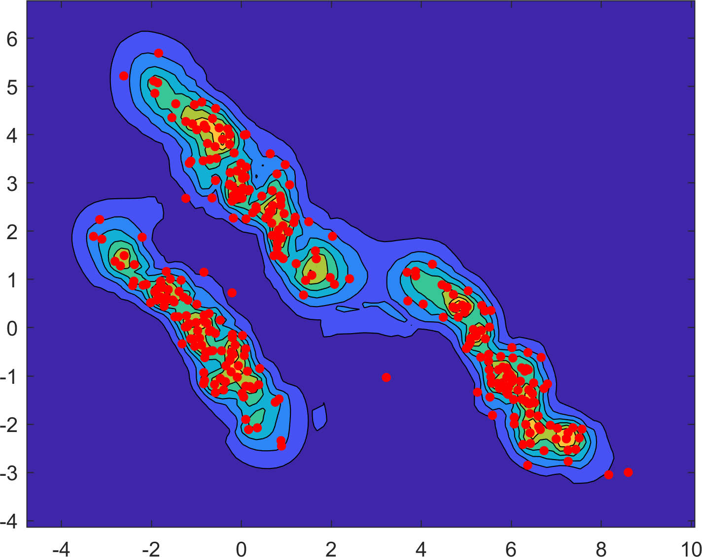

# Implementation of ULEF
## Introduction
This repository provides an experimental implementation for the outlier score *UMAP-based [2] Local Entropy Factor* (ULEF). The method is presented in the work "An Entropy Based Outlier Score and its Application to Novelty Detection for Road Infrastructure Images" published in [31st IEEE Intelligent Vehicles Symposium 2020](https://2020.ieee-iv.org/) [1].

The ULEF score is calculated based on the weighted nearest neighbor graph which is constructed during the dimensionality reduction using UMAP. The implementation is based on the original implementation of UMAP [2].

## Requirements
This repository requires the UMAP for python to be installed. According to [3], it can be installed with
`pip install umap-learn`, given that `numba`, `scikit-learn` and hence `numpy` and `scipy` are installed.

The functions itself are implemented in MATLAB calling Python subfunctions.

At least MATLAB 2019a is required to run the examples.

## Examples
### Results on road infrastructure images
The [images](/Data) used for the outlier detection are generated with an extension of the [openDRIVE tool](https://github.com/JWTHI/openDRIVE-Matlab). Here, the route as in [1] is shown.  

The [base dataset](/Data/MUC_B300_n) is used with one of the images in the [outlier dataset](/Data/A9_THI_Residential), generating the outlier score as indicated by the color  in the figure.  
Running `main_scenario_route.m` will reproduce the figure.  
 
|  |
|:---:|
| Route |


### Results on toy datasets
The methods abilities are presented using 5 toy datasets. The results can be seen in the following figure. Blue indicates high and yellow low outliership.  
Running `main ` will reproduce the figure. The execution might take very long.


|  |  |  |  
|:---:|:---:|:---:|  
|  |  |  |  

## Usage
Within this repository, two different types of implementations are used.
1. Standard use (slow for repeated calculations)
	- Function `[ULEF,USLEF,knnIndex] = outlierULEF(Data,k,RNS)`  
	The basic function calculating the outlier scores ULEF and USLEF for each data point in data.
		- `k`: Number of neighbors used to construct the graph.
		- `RNS`: Random number seed used to construct the approximate nearest neighbor graph.
		- `Data`: The dataset as array. Each row is a sample.
		- `ULEF`: The resulting ULEF scores [0,1] for the samples in `Data` as vector. The higher the less an outlier.
		- `USLEF`: The resulting USLEF scores [0,1] for the samples in `Data` as vector. The higher the less an outlier.
		- `knnIndex`: The closest neighbors of each sample.
	- Example `main.m`  
	The script is generating the examples as shown in the [plots](#Results-on-toy-datasets).
	**Note**: Execution may take very long, since the standard function is used. For faster execution the `outlierULEF_D` should be used.
2. Delta use (slow for single use, fast for repeated use)
	- Function `[ ULEF,rhos,sigmas] = outlierULEF_D(knnDists, knnIndex, Data, k, RNS, D, rhosOld, sigmasOld, knnIndexOld, ULEFOld)`  
	The function calculates the ULEF score. But here, it only new data points are considered, for the old data points, the previous information is used if the neighborhood did not change. A new data point has to be the last in the dataset.
		- `knnDists` : **Current** Distance to nearest neighbor, including the outlier.
		- `D`: **Current** Distance matrix
		- `rhosOld`: **Previous** distance to closest neighbor per data point (required for weight calculation)
		- `sigmasOld`: **Previous** parameters per data point (required for weight calculation)
		- `knnIndexOld`: **Previous** closest neighbors of each sample.
		- `ULEFold`: **Previous** outlier scores.
		- `ULEF`: **Current** outlier scores.
		- `rhos`: **Current** distance to closest neighbor per data point (required for weight calculation)
		- `sigmas`: **Current** parameters per data point (required for weight calculation)
	- Example `main_scenario_route.m`  
	The script is generating the [plot](#Results-on-road-infrastructure-images).
## License
[LICENSE](LICENSE)

## References
[1]: **An Entropy Based Outlier Score and its Application to Novelty Detection for Road Infrastructure Images**; Jonas Wurst, Alberto Flores Fernández, Michael Botsch and Wolfgang Utschick; *2020 IEEE Intelligent Vehicles Symposium (IV)*; [Paper](tba)

[2]: **UMAP: Uniform Manifold Approximation and Projection for Dimension Reduction**; Leland McInnes, John Healy, James Melville; *2018*; [Paper](https://arxiv.org/abs/1802.03426)


[3]: **UMAP: Uniform Manifold Approximation and Projection**; Leland McInnes, John Healy, Nathaniel Saul, Lukas Grossberger; *2018 The Journal of Open Source Software vol.3 #29*; [Code](https://github.com/lmcinnes/umap)


## Citation
To cite the work use:
```
@INPROCEEDINGS{WurstIV20,
author={J. {Wurst} and A. {Flores Fernández} and M. {Botsch} and W. {Utschick}},
booktitle={2020 IEEE Intelligent Vehicles Symposium (IV)},
title={{An Entropy Based Outlier Score and its Application to Novelty Detection for Road Infrastructure Images}},
year={2020}
}
```
